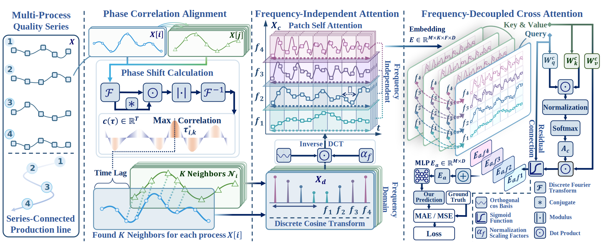

# PAF-Net: Frequency-Decoupled Network with Phase-Correlation Alignment for Multi-Process Manufacturing Quality Prediction

<div align="center">
  
  
  
  
</div>

This repository contains the official PyTorch implementation of **PAF-Net**, a novel frequency-decoupled time series prediction framework designed for multi-process manufacturing quality prediction.

## 🎯 Overview

<div align="center">
  
  <p><em>Schematic of Real-World Manufacturing. The middle part shows the vehicle production chain with multiple processes. Three subgraphs illustrate identified challenges. Correlations in Challenges 1 and 3 are calculated by the Pearson Coefficient.</em></p>
</div>

PAF-Net addresses three critical challenges in manufacturing quality prediction:
- **Time-lagged process interactions** between upstream and downstream operations
- **Compound periodicity** from overlapping manufacturing operations with distinct frequencies  
- **Frequency-decoupled dependencies** where meaningful correlations exist only in shared frequency bands

### Key Innovations

1. **Phase-Correlation Alignment**: Frequency-domain energy analysis to synchronize time-lagged quality series
2. **Frequency-Independent Patch Attention**: DCT decomposition paired with attention mechanisms to capture heterogeneous operational features
3. **Frequency-Decoupled Cross-Attention**: Suppresses noise from irrelevant frequencies while focusing on meaningful dependencies within shared bands

## 🏗️ Architecture

<div align="center">
  
  <p><em>PAF-Net Framework: Phase Correlation Alignment → Frequency Decomposition → Frequency-Decoupled Attention</em></p>
</div>

The framework consists of three main components:

### 1. Phase Correlation Alignment
```python
# Automatically aligns time-lagged series using frequency-domain phase correlation
leader_ids, shift_steps, correlations = phase_correlation(x)
x_aligned = expand_with_leaders(x, leader_ids, shift_steps)
```

### 2. Frequency Decomposition & Patch Attention
```python
# DCT decomposition into orthogonal frequency components
frequency_components = dct_decompose(x_aligned, n_frequencies=5)
# Independent attention for each frequency band
features = frequency_independent_attention(frequency_components)
```

### 3. Cross-Attention with Frequency Decoupling
```python
# Models dependencies only within same-frequency components
cross_attended = frequency_decoupled_cross_attention(features)
predictions = prediction_head(cross_attended)
```

## 🚀 Quick Start

### Installation

```bash
# Install dependencies
pip install torch torch_dct numpy pandas scikit-learn
```

### Basic Usage

```bash
# Train PAF-Net on Production dataset
python run_longExp.py \
  --model PAFNet \
  --dataset Production \
  --seq_len 360 \
  --pred_len 36 \
  --decomposition 5 \
  --patch_leaders 3 \
  --learning_rate 0.001
```

## 🔧 Key Parameters

### PAF-Net Specific
- `--decomposition`: Number of frequency components for DCT decomposition (default: 5)
- `--patch_leaders`: Number of leader variables per patch (default: 1) 
- `--decomp_method`: Decomposition method, options: ['dct'] (default: 'dct')
- `--patch_len`: Length of each patch for attention (default: 16)

## 📈 Datasets

As a demonstration of PAF-Net's capabilities, we provide the following example dataset:

**Production**: Temperature sensor data from roasting machine chambers, featuring multi-process interactions and compound periodicity patterns typical in manufacturing environments. This dataset serves as a representative example of the complex temporal dependencies that PAF-Net is designed to handle.

The provided dataset includes:
- Multi-variate time series with process interactions
- Time-lagged dependencies between upstream and downstream operations  
- Compound frequency patterns from overlapping manufacturing cycles
- Quality measurements suitable for prediction tasks

## 📄 License

This project is licensed under the MIT License - see the [LICENSE](LICENSE) file for details.